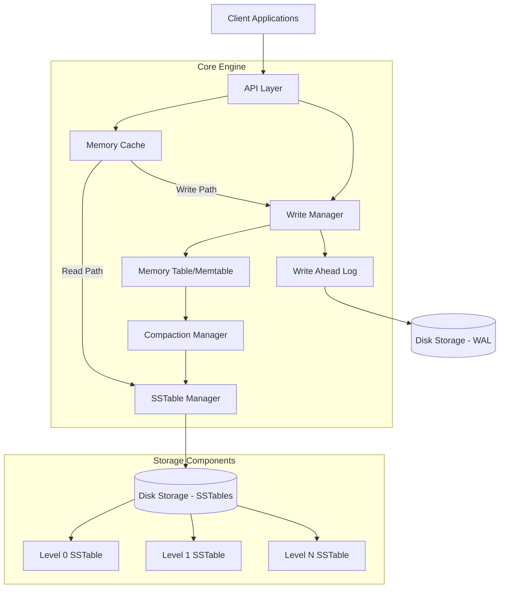

# Nahida-KV Architecture Overview

This document provides a high-level architecture overview of the Nahida-KV storage engine.

## Architecture Diagram

## Component Description

### Client Interface
- **API Layer**: Provides the primary interface for client applications to interact with the storage engine.

### Memory Components
- **Memory Cache**: In-memory cache for frequently accessed key-value pairs
- **Write Manager**: Handles incoming write operations
- **Memory Table (Memtable)**: In-memory sorted structure for recent writes

### Persistence Layer
- **Write Ahead Log (WAL)**: Ensures durability by logging operations before they are applied
- **SSTable Manager**: Manages the creation and organization of Sorted String Tables
- **Compaction Manager**: Handles merging of SSTables and optimization of storage

### Storage Hierarchy
- **Level 0**: Contains newest SSTables with possible overlapping key ranges
- **Level 1+**: Contains older data with non-overlapping key ranges
- **Disk Storage**: Persistent storage for both WAL and SSTables